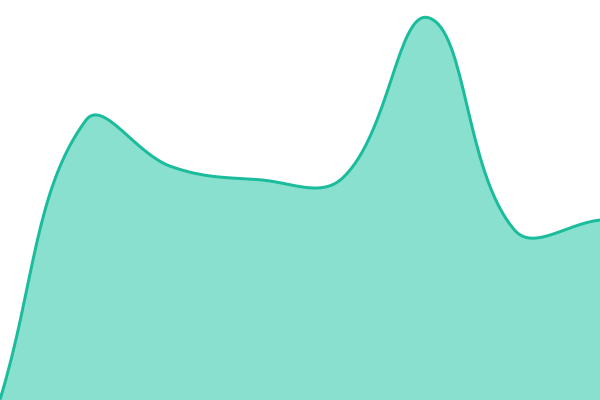

# [📈 Live Status](https://status.arabtherapy.com): <!--live status--> **🟧 Partial outage**

This repository contains the open-source uptime monitor and status page for [Abd AL-Hadi Obaid](https://status.arabtherapy.com), powered by [Upptime](https://github.com/upptime/upptime).

With [Upptime](https://upptime.js.org), you can get your own unlimited and free uptime monitor and status page, powered entirely by a GitHub repository. We use [Issues](https://github.com/abdalhadiobaid/status/issues) as incident reports, [Actions](https://github.com/abdalhadiobaid/status/actions) as uptime monitors, and [Pages](https://status.arabtherapy.com) for the status page.

<!--start: status pages-->
<!-- This summary is generated by Upptime (https://github.com/upptime/upptime) -->
<!-- Do not edit this manually, your changes will be overwritten -->
<!-- prettier-ignore -->
| URL | Status | History | Response Time | Uptime |
| --- | ------ | ------- | ------------- | ------ |
|  [Arab Therapy Web](https://arabtherapy.com) | 🟩 Up | [arab-therapy-web.yml](https://github.com/abdalhadiobaid/status/commits/HEAD/history/arab-therapy-web.yml) | 

 387ms
     
 | 

<a href="https://status.arabtherapy.com/history/arab-therapy-web">100.00%</a>
    

|  [Arab Therapy API](https://arabtherapy.com/api/health) | 🟥 Down | [arab-therapy-api.yml](https://github.com/abdalhadiobaid/status/commits/HEAD/history/arab-therapy-api.yml) | 

 211ms
     
 | 

<a href="https://status.arabtherapy.com/history/arab-therapy-api">29.24%</a>
    

|  [Patient Mobile App Backend](https://arabtherapy.com/api) | 🟥 Down | [patient-mobile-app-backend.yml](https://github.com/abdalhadiobaid/status/commits/HEAD/history/patient-mobile-app-backend.yml) | 

 256ms
     
 | 

<a href="https://status.arabtherapy.com/history/patient-mobile-app-backend">43.19%</a>
    

|  [Therapist Mobile App Backend](https://arabtherapy.com/api) | 🟥 Down | [therapist-mobile-app-backend.yml](https://github.com/abdalhadiobaid/status/commits/HEAD/history/therapist-mobile-app-backend.yml) | 

 247ms
     
 | 

<a href="https://status.arabtherapy.com/history/therapist-mobile-app-backend">100.00%</a>
    

<!--end: status pages-->

[**Visit our status website →**](https://status.arabtherapy.com)

## 📄 License

- Powered by: [Upptime](https://github.com/upptime/upptime)
- Code: [MIT](./LICENSE) © [Anand Chowdhary](https://anandchowdhary.com)
- Data in the `./history` directory: [Open Database License](https://opendatacommons.org/licenses/odbl/1-0/)
